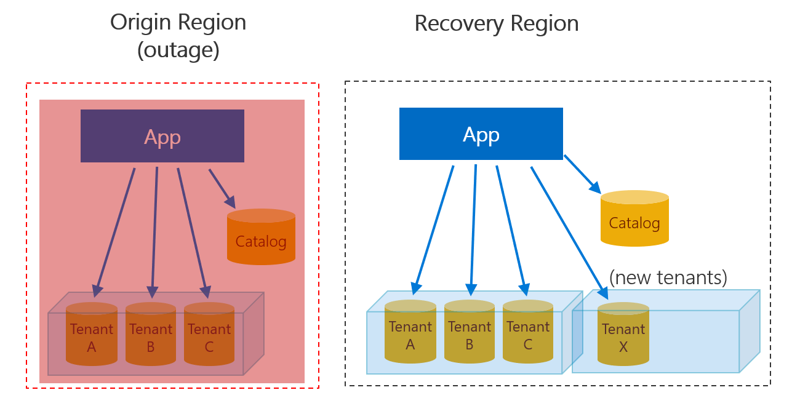
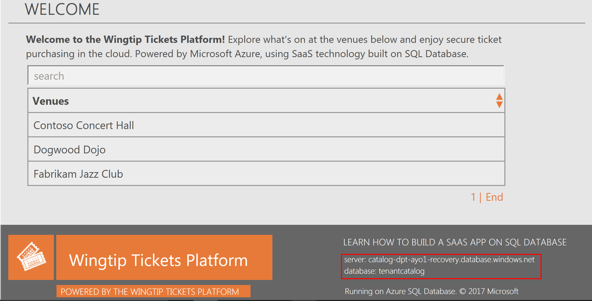

# Recover multi-tenant SaaS application using backups

In this tutorial, you learn how to recover a multi-tenant SaaS application into a recovery region in the event of a regional outage. You use the geo-restore and server alias capabilities of Azure SQL database, along with Azure Resource Manager (ARM) templates to restore the Wingtip Tickets SaaS Database per tenant application into a recovery region.

You will learn how to:

* Sync tenant configuration data into the tenant catalog database
* Use tenant aliases to ensure no code changes are required during the recovery process 
* Restore Azure SQL servers, Elastic pools, and Azure SQL databases into a recovery region 

To complete this tutorial, make sure the following prerequisites are completed:

* Azure PowerShell is installed. For details, see [Getting started with Azure PowerShell](https://docs.microsoft.com/powershell/azure/get-started-azureps)

## Introduction to the SaaS application geo-restore recovery pattern

Recovering a SaaS app into a recovery region can be challenging. Doubly so if the app is operating at scale. In addition to creating backup instances in a recovery region, you have to coordinate the recovery to ensure that: your highest priority tenants are least affected, all existing connections to tenant resources are routed to the recovered instances when they become available, and there are minimal or no code changes that you will have to undo once the outage is fixed. All of this has to be done in a speedy, and cost-effective manner that allows you to reduce the impact of an outage on your normal business operations. How is this done?

In this tutorial, these challenges are solved by using the capabilities of Azure SQL database and the Azure platform:

* You use the [geo-restore capability of Azure SQL databases](https://docs.microsoft.com/azure/sql-database/sql-database-disaster-recovery) to restore the tenant databases used by the Wingtip Tickets SaaS database per tenant application. 
* You use the DNS alias capability of Azure SQL databases to create tenant aliases that will be used by the Wingtip Tickets SaaS app. These aliases can be routed to recovery tenant resources as they become available and help ensure the app can be recovered with no code or configuration changes.
* You use Azure Resource Manager (ARM) templates to restore tenant resources in batches. Restoring in batches allows you to prioritize the order in which tenant resources are recovered. Additionally, it allows you to sustain recovery operations without overloading system resources. 

The recovery process illustrated in this tutorial has been orchestrated to allow for:

* Optimizing for restoring high-priority tenants fastest and minimizing impact to them
* Optimizing for getting tenants online as soon as possible by doing restores in parallel
* Preserving the identity of a tenant database after recovery so no app changes would be required
* No penalty for attempting a geo-restore when a region goes down and comes back online soon afterwards

## Deploy the Wingtip Tickets SaaS app with tenant aliases 
For this tutorial, you will need to create DNS aliases for each tenant and for the catalog database. Click the **Deploy to Azure** link below to deploy a version of the Wingtip Tickets SaaS Database per tenant application that creates aliases for each tenant and the catalog. 

Deploy the app in a new resource group, and provide a short *user* value that will be appended to several resource names to make them globally unique.  Your initials and a number is a good pattern to use.

## Get the disaster recovery management scripts 

The management and recovery scripts that will be used in this tutorial are available in the 'feature-DR-georestore' branch of the [Wingtip Tickets SaaS Database per tenant github repo](https://github.com/Microsoft/WingtipTicketsSaaS-DbPerTenant/tree/feature-AliasExtensions). Make sure to follow the steps in the repo to download and unblock the tutorial scripts on your local machine.

## Sync tenant configuration

Sync the configuration of tenant servers, elastic pools, and databases into the tenant catalog in order to recover them in a recovery region.

1. In the *PowerShell ISE*, open the ...\Learning Modules\UserConfig.psm1 file. Replace the '<resourcegroup>', and '<user>' variables with the names of the resource group and user variable that you used for the deployment above.

2. In the *PowerShell ISE*, open the ...\Learning Modules\Business Continuity and Disaster Recovery\DR-RestoreFromBackup\Demo-RestoreFromBackup.ps1 script and set the following values:
	* **$DemoScenario = 1, Start a background job that syncs tenant server, and pool configuration info into the catalog**

3. Press **F5** to run the sync script. This will launch a new PowerShell window to sync the current and any future configuration of tenant resources.

Leave the PowerShell window running in the background and continue onto the rest of the tutorial. 

## Recover tenant resources into recovery region

The recovery process outlined below uses four patterns to ensure that required resources are reserved, tenant resources are recovered as fast as possible, and normal business operations can resume with the least amount of downtime:

* Using Azure Resource Manager (ARM) templates to provision resources. In addition to analyzing resource dependencies to ensure resources are created in the correct order, ARM templates allow you to parallelize the creation of resources. 
* Tenant databases are not recovered until all tenant servers and elastic pools have been recovered. This 'land grab' ensures that the system resources required to recover tenant databases have been reserved.
* Tenant databases are recovered in priority order in small batches grouped by elastic pool. Restoring in priority order allows the recovery process to optimize for restoring the highest priority tenants first. In addition, restoring in small batches is done to not overload pool resources and introduce throttling which could slow down the entire recovery process.
* Provision resources that will be used to cater to new tenants separate from recovery. This allows you to resume normal business operations for new tenants without waiting to recover all your existing tenants first.

Below is a summary and timeline of the recovery process:

1. Disable traffic manager endpoint for web app. This will prevent users from connecting to the app in an invalid state should the region come online during recovery.

2. Use ARM template(s) to provision the resources needed to recreate the catalog database. These include: the recovery region resource group, the catalog recovery server, and a geo-restore of the tenant catalog database. Update the catalog alias to point to the recovered catalog database after recovery is complete.

3. Use ARM template(s) to provision the recovery app and any resources required to add new tenants to the platform. These include: the recovery instance of the Wingtip Tickets SaaS database per tenant app, a new-tenant server that will be used to store databases for new tenants, a new-tenant pool that will contain the databases of new tenants, and a traffic manager endpoint for the recovery instance of the app.
		
4. Mark all un-recovered tenants in the catalog as unavailable. This prevents the recovered app from accessing tenant resources before they are recovered.

5. Use ARM template(s) to provision all the container resources required for tenant databases. This reserves the resources that will be needed for database recovery and includes: tenant recovery servers, and tenant recovery elastic pools.

6. Once all elastic pools have been recovered, use an ARM template to restore tenant databases in priority order in small batches grouped by elastic pool. Once a tenant database has been restored, update the tenant alias to point to the recovered database instance and mark the tenant as online and available.

To run the recovery script, do the following:

1. In the *PowerShell ISE*, open the ...\Learning Modules\Business Continuity and Disaster Recovery\DR-RestoreFromBackup\Demo-RestoreFromBackup.ps1 script and set the following values:
	* **$DemoScenario = 2, Recover the SaaS app into a recovery region by restoring from geo-redundant backups**

2. Press **F5** to run the recovery script. This will recover tenant databases, servers, and elastic pools into the recovery region. You can monitor the status of the recovery by watching the console section of the PowerShell window.
	[insert screenshot of powershell window with code running]

	Explore the code behind the recovery jobs that are running by exploring the PowerShell scripts in the ...\Learning Modules\Business Continuity and Disaster Recovery\DR-RestoreFromBackup\RecoveryJobs folder.

When the recovery is complete, [navigate to the Azure portal](https://portal.azure.com) and inspect the recovered tenant resources in the recovery region resource group. Additionally, open the Wingtip Tickets Events Hub in your web browser (http://events.wingtip-dpt.<USER\>.trafficmanager.net - substitute <USER> with your deployment's user value) and notice the value reported for the catalog server is the recovery instance you just created.

## Next steps

In this tutorial you learned how to:

* Sync tenant configuration data into the tenant catalog database
* Use tenant aliases to ensure no code changes are required during the recovery process 
* Restore Azure SQL servers, Elastic pools, and Azure SQL databases into a recovery region 

Now, try the [SaaS failover tutorial]() to learn how to failover a multi-tenant application in the event of a regional outage. This method of recovery dramatically decreases the time needed to recover a multi-tenant application into a recovery region.

## Additional resources

* [Additional tutorials that build upon the Wingtip SaaS application](https://docs.microsoft.com/en-us/azure/sql-database/sql-database-wtp-overview#sql-database-wingtip-saas-tutorials)