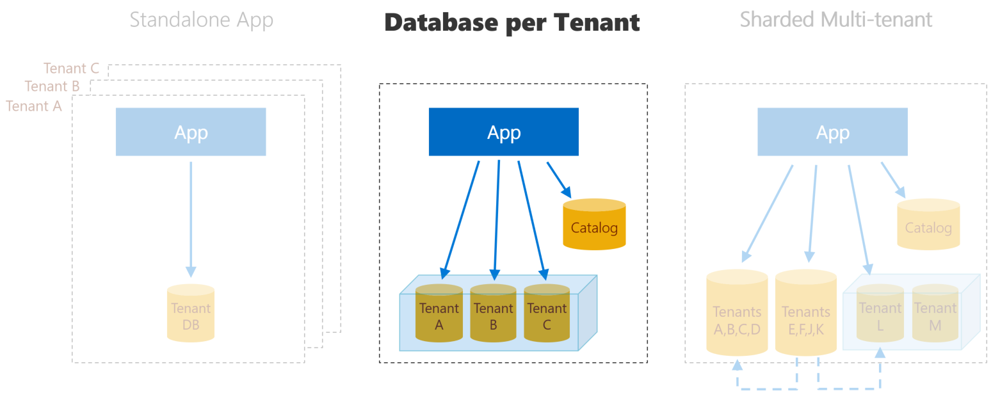

# Wingtip Tickets SaaS - Database per Tenant (with aliases) 
Sample multi-tenant SaaS application and associated management scripts.  
Built on SQL Database using a database-per-tenant model. 

## Overview
This project provides a sample SaaS application 'WingtipTicketsSaaS' that embodies many common SaaS patterns that can be used with Azure SQL Database. The Wingtip Tickets SaaS sample is based on an event-management and ticket-selling scenario for small venues. Each venue is a 'tenant' of the SaaS application. In this variation of the SaaS application, a DNS alias is created for each tenant database. This ensures that no connection string change is required in the app during a disaster recovery event or when repatriating databases afterwards.

## Differences from main 'Database per Tenant' project
* Deploys the Wingtip Tickets SaaS application with tenant database aliases that are used to ensure no app change is required during disaster recovery
* Includes a script that modifies an existing 'dbpertenant' deployment to include aliases for tenant databases and the catalog database (*Initialize-WingtipSaaSAliases.ps1*)
* Includes catalog functions that operate using tenant aliases in order to be unaffected by the recovery of databases into another region

## How to deploy sample app
>**NOTE:** if you install the application, you will be charged for the Azure resources created.  Actual costs incurred are based on your subscription offer type but are nominal if the application is not scaled up unreasonably and is deleted promptly after you have finished exploring the tutorials.

To deploy the app to Azure, click the blue link below. Deploy the app in a new resource group, and provide a short *user* value that will be appended to several resource names to make them globally unique.  Your initials and a number is a good pattern to use.

<a href="https://aka.ms/deploywingtipdpt-aliases" target="_blank">
    
</a>

The basic application, which includes three pre-defined databases for three venues, can be installed in your Azure subscription under a single ARM resource group. After deployment completes, launch the app by browsing to ```http://events.wingtip-dpt.USER.trafficmanager.net```, substituting *USER* with the value you set during deployment. To uninstall the application, delete the resource group from the Azure Portal.


## How to run management scripts and tutorials
>**IMPORTANT:** If you download and extract the repo or Learning Modules from a zip file, make sure you unblock the .zip file before extracting. Executable contents (scripts, dlls) may be blocked by Windows when zip files are downloaded from an external source and extracted.

>To avoid scripts from being blocked by Windows:

>1. Right click the zip file and select **Properties**.
>2. On the **General** tab, select **Unblock** and select **OK**.

1. Install [AzurePowerShell module 5.0 or above](https://github.com/Azure/azure-powershell/releases). This version of AzurePowerShell adds alias functions for Azure SQL database that will be used in the management scripts.  
*If your PowerShell session does not allow running scripts, make sure you've run the `Set-ExecutionPolicy RemoteSigned` command*

2. Install the SqlServer PowerShell module. This installs cmdline functions like 'Invoke-SqlCmd' that are used by the PowerShell scripts to connect to tenant databases. `Install-Module sqlserver`

3. Clone the repo to your local machine. Or Download and extract the repo to your local machine from a zip file.

4. Open the [GeoRestoreTutorial document](Learning%20Modules\Business%20Continuity%20and%20Disaster%20Recovery\DR-RestoreFromBackup\GeoRestoreTutorial.md) in the '...Learning Modules\Business Continuity and Disaster Recovery\DR-RestoreFromBackup' to start the tutorial for disaster recovery using the Azure SQL database geo-restore capability

5. Run the demo scripts present in the '...Learning Modules\Business Continuity and Disaster Recovery\DR-RestoreFromBackup' folder.


## Architecture

The sample uses a database-per-tenant model, with a database created for each venue.  
These databases are hosted in elastic database pools to provide easy performance management, and to cost-effectively accommodate the unpredictable usage patterns of these small venues and their customers.  
An additional catalog database holds the mapping between tenants and their databases.  This mapping is managed using the Shard Map Management features of the Elastic Database Client Library.  

More information about the sample app and the associated tutorials is here: [https://aka.ms/sqldbsaastutorial](https://aka.ms/sqldbsaastutorial)

## License
Microsoft Wingtip SaaS sample application and tutorials are licensed under the MIT license. See the [LICENSE](https://github.com/Microsoft/WingtipSaaS/blob/master/license) file for more details.

# Contributing

This project has adopted the [Microsoft Open Source Code of Conduct](https://opensource.microsoft.com/codeofconduct/). For more information see the [Code of Conduct FAQ](https://opensource.microsoft.com/codeofconduct/faq/) or contact [opencode@microsoft.com](mailto:opencode@microsoft.com) with any additional questions or comments.
